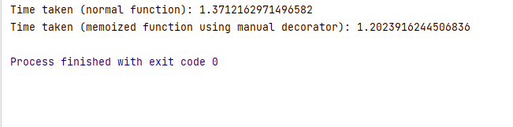
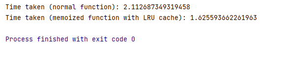
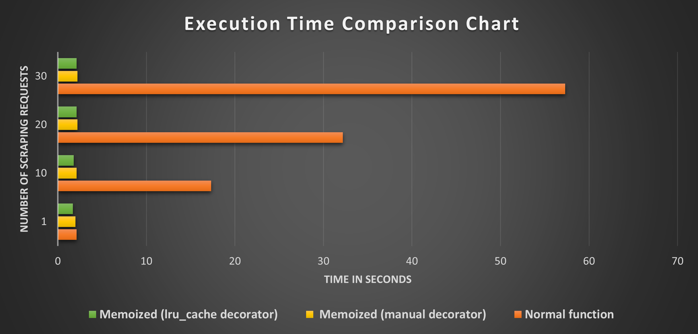

# Python Cache: How to Speed Up Your Code with Effective Caching
  * [How to implement a cache in Python](#how-to-implement-a-cache-in-python)
    + [Install the required libraries](#install-the-required-libraries)
    + [Method 1: Python caching using a manual decorator](#method-1-python-caching-using-a-manual-decorator)
    + [Method 2: Python caching using LRU cache decorator](#method-2-python-caching-using-lru-cache-decorator)
    + [Performance comparison](#performance-comparison)

This article will show you how to use caching in Python with your web
scraping tasks. You can read the [<u>full
article</u>](https://oxylabs.io/blog/python-cache-how-to-use-effectively)
on our blog, where we delve deeper into the different caching
strategies.

## How to implement a cache in Python

There are different ways to implement caching in Python for different
caching strategies. Here we’ll see two methods of Python caching for a
simple web scraping example. If you’re new to web scraping, take a look
at our [<u>step-by-step Python web scraping
guide</u>](https://oxylabs.io/blog/python-web-scraping).

### Install the required libraries

We’ll use the [<u>requests
library</u>](https://pypi.org/project/requests/) to make HTTP requests
to a website. Install it with
[<u>pip</u>](https://pypi.org/project/pip/) by entering the following
command in your terminal:

```bash
python -m pip install requests
```

Other libraries we’ll use in this project, specifically `time` and
`functools`, come natively with Python 3.11.2, so you don’t have to
install them.

### Method 1: Python caching using a manual decorator

A [<u>decorator</u>](https://peps.python.org/pep-0318/) in Python is a
function that accepts another function as an argument and outputs a new
function. We can alter the behavior of the original function using a
decorator without changing its source code.

One common use case for decorators is to implement caching. This
involves creating a dictionary to store the function's results and then
saving them in the cache for future use.

Let’s start by creating a simple function that takes a URL as a function
argument, requests that URL, and returns the response text:

```python
def get_html_data(url):
    response = requests.get(url)
    return response.text
```

Now, let's move toward creating a memoized version of this function:

```python
def memoize(func):
    cache = {}

    def wrapper(*args):
        if args in cache:
            return cache[args]
        else:
            result = func(*args)
            cache[args] = result
            return result

    return wrapper


@memoize
def get_html_data_cached(url):
    response = requests.get(url)
    return response.text
```

The `wrapper` function determines whether the current input arguments have
been previously cached and, if so, returns the previously cached result.
If not, the code calls the original function and caches the result
before being returned. In this case, we define a `memoize` decorator that
generates a `cache` dictionary to hold the results of previous function
calls.

By adding `@memoize` above the function definition, we can use the memoize
decorator to enhance the `get_html_data` function. This generates a new
memoized function that we’ve called `get_html_data_cached`. It only makes
a single network request for a URL and then stores the response in the
cache for further requests.

Let’s use the `time` module to compare the execution speeds of the
`get_html_data` function and the memoized `get_html_data_cached` function:

```python
import time


start_time = time.time()
get_html_data('https://books.toscrape.com/')
print('Time taken (normal function):', time.time() - start_time)


start_time = time.time()
get_html_data_cached('https://books.toscrape.com/')
print('Time taken (memoized function using manual decorator):', time.time() - start_time)
```

Here’s what the complete code looks like:

```python
# Import the required modules
from functools import lru_cache
import time
import requests


# Function to get the HTML Content
def get_html_data(url):
    response = requests.get(url)
    return response.text


# Memoize function to cache the data
def memoize(func):
    cache = {}

    # Inner wrapper function to store the data in the cache
    def wrapper(*args):
        if args in cache:
            return cache[args]
        else:
            result = func(*args)
            cache[args] = result
            return result

    return wrapper


# Memoized function to get the HTML Content
@memoize
def get_html_data_cached(url):
    response = requests.get(url)
    return response.text


# Get the time it took for a normal function
start_time = time.time()
get_html_data('https://books.toscrape.com/')
print('Time taken (normal function):', time.time() - start_time)

# Get the time it took for a memoized function (manual decorator)
start_time = time.time()
get_html_data_cached('https://books.toscrape.com/')
print('Time taken (memoized function using manual decorator):', time.time() - start_time)
```

And here’s the output:


Notice the time difference between the two functions. Both take almost
the same time, but the supremacy of caching lies behind the re-access.

Since we’re making only one request, the memoized function also has to
access data from the main memory. Therefore, with our example, a
significant time difference in execution isn’t expected. However, if you
increase the number of calls to these functions, the time difference
will significantly increase (see [<u>Performance
Comparison</u>](#performance-comparison)). 

### Method 2: Python caching using LRU cache decorator

Another method to implement caching in Python is to use the built-in
`@lru_cache` decorator from `functools`. This decorator implements cache
using the least recently used (LRU) caching strategy. This LRU cache is
a fixed-size cache, which means it’ll discard the data from the cache
that hasn’t been used recently.

To use the `@lru_cache` decorator, we can create a new function for
extracting HTML content and place the decorator name at the top. Make
sure to import the `functools` module before using the decorator: 

```python
from functools import lru_cache


@lru_cache(maxsize=None)
def get_html_data_lru(url):
    response = requests.get(url)
    return response.text
```

In the above example, the `get_html_data_lru` method is memoized using the
`@lru_cache` decorator. The cache can grow indefinitely when the `maxsize`
option is set to `None`.

To use the `@lru_cache` decorator, just add it above the `get_html_data_lru`
function. Here’s the complete code sample:

```python
# Import the required modules
from functools import lru_cache
import time
import requests


# Function to get the HTML Content
def get_html_data(url):
    response = requests.get(url)
    return response.text


# Memoized using LRU Cache
@lru_cache(maxsize=None)
def get_html_data_lru(url):
    response = requests.get(url)
    return response.text


# Get the time it took for a normal function
start_time = time.time()
get_html_data('https://books.toscrape.com/')
print('Time taken (normal function):', time.time() - start_time)

# Get the time it took for a memoized function (LRU cache)
start_time = time.time()
get_html_data_lru('https://books.toscrape.com/')
print('Time taken (memoized function with LRU cache):', time.time() - start_time)
```

This produced the following output:


### Performance comparison

In the following table, we’ve determined the execution times of all
three functions for different numbers of requests to these functions:

| **No. of requests** | **Time taken by normal function** | **Time taken by memoized function (manual decorator)** | **Time taken by memoized function (lru_cache decorator)** |
|---------------------|-----------------------------------|--------------------------------------------------------|-----------------------------------------------------------|
| 1                   | 2.1 Seconds                       | 2.0 Seconds                                            | 1.7 Seconds                                               |
| 10                  | 17.3 Seconds                      | 2.1 Seconds                                            | 1.8 Seconds                                               |
| 20                  | 32.2 Seconds                      | 2.2 Seconds                                            | 2.1 Seconds                                               |
| 30                  | 57.3 Seconds                      | 2.22 Seconds                                           | 2.12 Seconds                                              |

As the number of requests to the functions increases, you can see a
significant reduction in execution times using the caching strategy. The
following comparison chart depicts these results:


The comparison results clearly show that using a caching strategy in
your code can significantly improve overall performance and speed.

Feel free to visit our [<u>blog</u>](https://oxylabs.io/blog) for an
array of intriguing web scraping topics that will keep you hooked!
